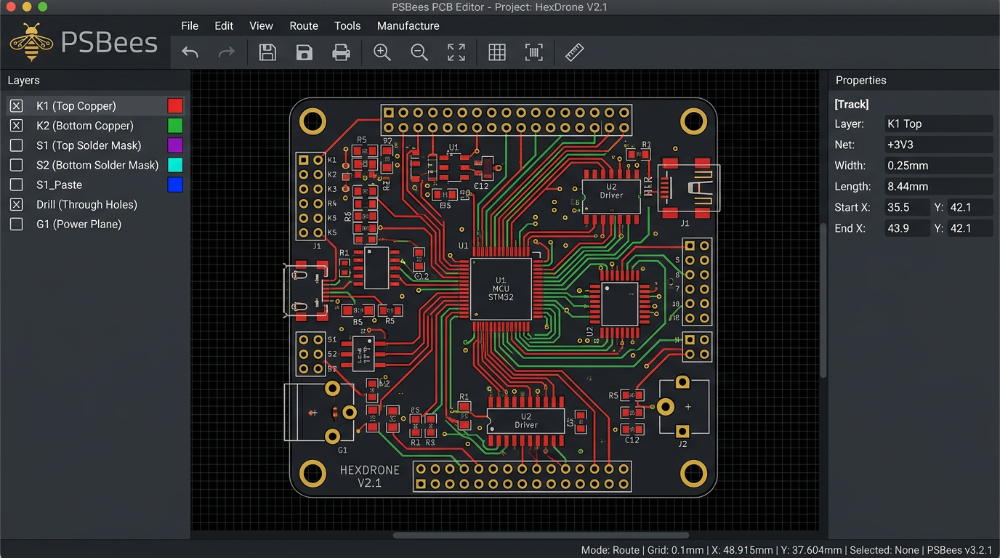
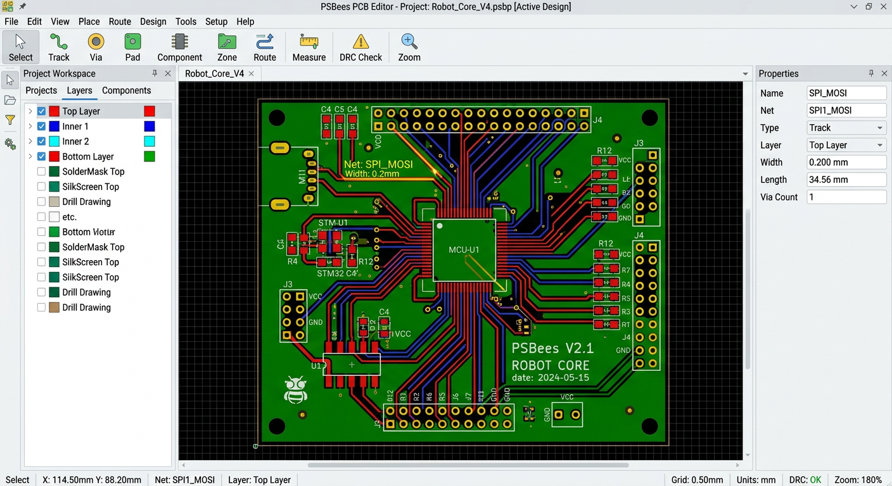
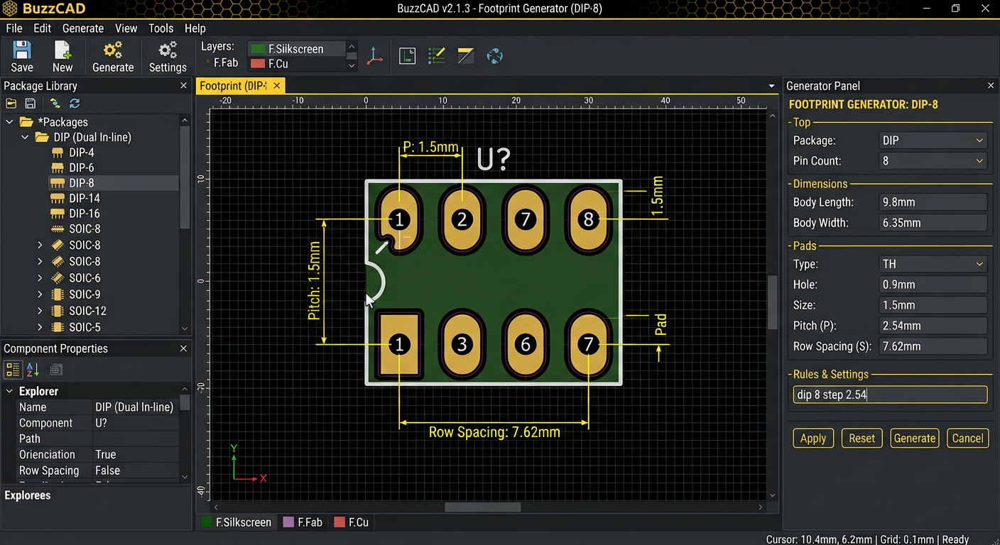
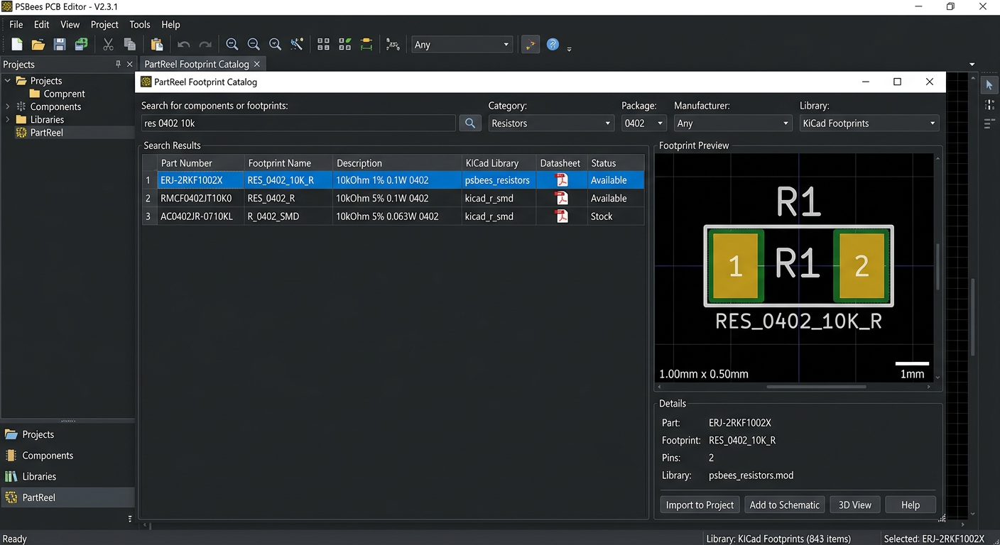
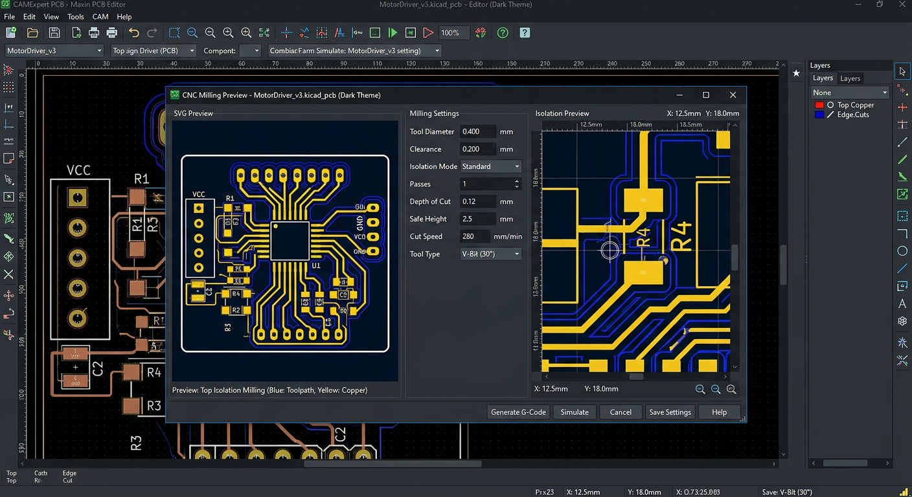
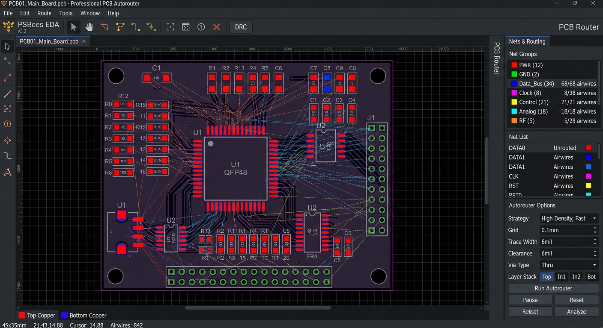
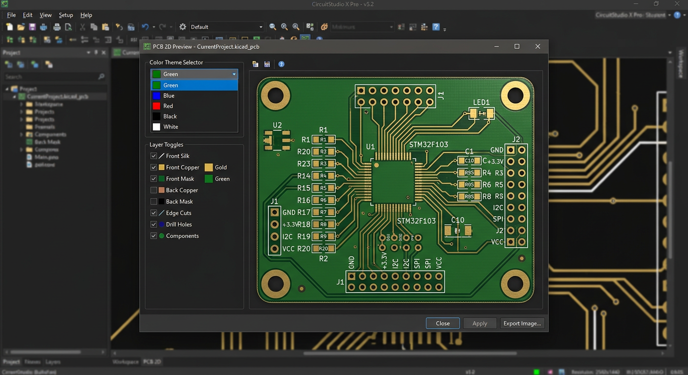
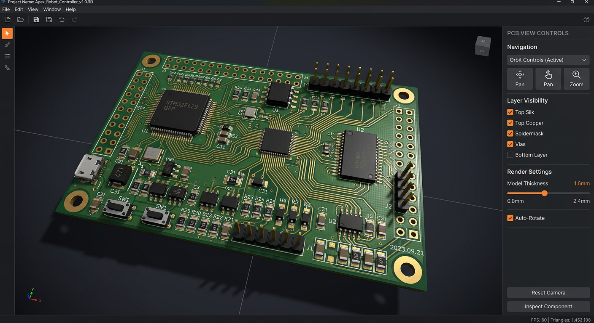
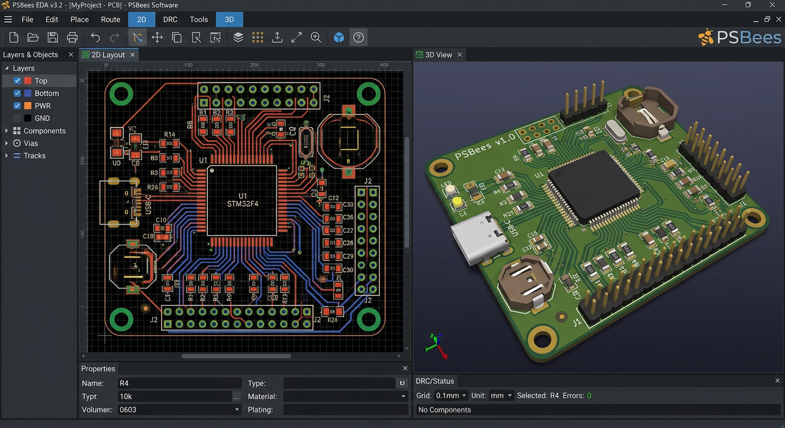

<p align="center">
  
</p>
<h1 align="center">PSBees — редактор печатных плат для Linux и Windows</h1>

<p align="center">
  <br/>
  <em>Тёмная тема — основной интерфейс с платой, слоями и свойствами</em>
</p>

## Скриншоты

<table>
<tr>
<td align="center"><br/><sub>Главный редактор (тёмная тема)</sub></td>
<td align="center"><br/><sub>Светлая тема</sub></td>
</tr>
<tr>
<td align="center"><br/><sub>Генератор деталей — строка → footprint</sub></td>
<td align="center"><br/><sub>Онлайн-каталог PartReel</sub></td>
</tr>
<tr>
<td align="center"><br/><sub>ЧПУ: предпросмотр в отдельном окне (необязательный)</sub></td>
<td align="center"><br/><sub>Автотрассировка и группы соединений</sub></td>
</tr>
<tr>
<td align="center"><br/><sub>2D предпросмотр — разные цвета маски (зелёная, синяя, красная, чёрная, белая)</sub></td>
<td align="center"><br/><sub>3D предпросмотр — объёмная плата прямо на сайте (Three.js)</sub></td>
</tr>
<tr>
<td align="center" colspan="2"><br/><sub>Объединённый предпросмотр — вкладки 2D (цвета и слои) и 3D (объём) прямо на сайте</sub></td>
</tr>
</table>

Веб-приложение для черчения (разводки) печатных плат в духе **Sprint-Layout**.
На Linux работает в браузере; на Windows — как обычная программа **`PSBees.exe`**
с установщиком **`PSBees-Setup.exe`**. Есть **общий сервер для нескольких компьютеров**
с регистрацией по email, облачным сохранением проектов и отдельной админ-панелью
([инструкция по развёртыванию](DEPLOY_SERVER.md)). Фирменный стиль «пчелиный»:
две темы — **тёмная** (по умолчанию) и **светлая**, переключаются кнопкой в шапке.

> Бренд: исходный логотип — `assets/logo.png`, все иконки и фавикон генерируются
> из него командой `npm run icons` (`scripts/make-icons.py`).

## Запуск

> **Windows:** скачайте установщик **`PSBees-Setup.exe`** (ярлык в «Пуск», запуск `PSBees.exe`)
> или портативный **`PSBees-portable.exe`**. Пошагово: **[INSTALL_WINDOWS.md](INSTALL_WINDOWS.md)**.
> Сборка установщика на машине с Windows: `npm run dist:win` → папка `release/`.
> Чтобы GitHub сам собирал оба `.exe`, скопируйте `scripts/win/windows.yml` в `.github/workflows/windows.yml`.

> **Впервые в Linux или никогда не открывали терминал?**
> Вам сюда: **[пошаговая инструкция для новичков → INSTALL_UBUNTU.md](INSTALL_UBUNTU.md)** —
> как установить Node.js, скачать и запустить программу, обновить и удалить её,
> и что делать, если что-то пошло не так.

### Коротко: установка на Ubuntu

Нужен `git`, чтобы скачать проект. Установщик сам подтянет свежие коммиты из GitHub
(`git pull`, если это git-копия), скачает Node.js 24 LTS и npm (если их нет), все библиотеки
проекта, соберёт приложение и создаст ярлык в меню приложений и на Рабочем столе (если папка
доступна). Для установки Node.js может потребоваться пароль администратора; подробности —
в [инструкции](INSTALL_UBUNTU.md).

```bash
git clone https://github.com/danilka-revin/linux_pcb_app.git ~/linux_pcb_app
cd ~/linux_pcb_app
bash install-ubuntu.sh   # сборка + установка + ярлык в меню «Приложения» (без sudo!)
```

После установки приложение запускается **одним кликом** на ярлык
«PSBees — редактор печатных плат» в меню приложений Ubuntu
или командой `psbees` в терминале.
Файлы ставятся в `~/.local/share/psbees`, лаунчер — `~/.local/bin`,
ярлык — `~/.local/share/applications`. Локальный сервер поднимается сам
и повторно использует уже запущенный экземпляр (порт 8484; другой порт —
`PCB_APP_PORT=8485 bash install-ubuntu.sh`, журнал — `~/.local/share/psbees/server.log`).

Обновление: `bash install-ubuntu.sh` (свежие коммиты подтянутся сами) или, если хочется
вручную, `git pull && bash install-ubuntu.sh`. При запуске приложение тоже проверяет
GitHub и обновляется само — так что переустановка из давно не обновлённой копии больше
не откатывает программу на старую версию.

Быстрый запуск без установки ярлыка (тоже «одной командой»):

```bash
bash run.sh              # соберёт dist при необходимости и откроет браузер (порт 8080)
```

### Режим разработчика

```bash
npm install
npm run dev        # http://localhost:5173
```

Сборка продакшн-версии: `npm run build` → `dist/` (статика, можно раздавать любым сервером,
например встроенным: `npm run start` — http://localhost:8080, проверка: `/healthz`).

### Общий сервер с пользователями и проектами

Для нескольких ПК запустите **отдельный серверный режим**, а не `bash run.sh`:
Node.js **22.13+** (лучше 24), `npm ci && npm run build`, затем выберите постоянный каталог
для базы данных вне `dist/` и создайте администратора:

```bash
export PSBEES_DATA_DIR="$HOME/psbees-data"
node scripts/cloud-admin.mjs create-admin admin@example.com
HOST=0.0.0.0 PORT=8080 npm run start:cloud
```

Сотрудники открывают `http://IP-СЕРВЕРА:8080/`, регистрируются по email/паролю и
сохраняют платы через кнопку **«Проекты»**. Админ входит на `/admin`: список пользователей
и всех проектов, поиск, блокировки, роли, журнал действий и скачивание резервных копий.
Пароли хранятся как salted scrypt, доступ к проектам разграничен; одновременные правки
одного проекта не затирают друг друга. Локальный `.laypcb.json` и офлайн-режим остаются.

**Настройка HTTPS, прав доступа, автозапуска, бэкапа и ограничения регистрации:**
[DEPLOY_SERVER.md](DEPLOY_SERVER.md). Сейчас почта используется как логин **без письма
для подтверждения адреса** (SMTP не подключён); для реальной сети настройте HTTPS.

Тесты: `npm test` (логика + генератор деталей + SSR + круговая совместимость
`.lay6`/`.lmk` на реальных файлах Sprint-Layout из `test/fixtures`).

Проверки 3D без браузера: `npm run test:3d` (также входят в `npm test`).
Проверки реального WebGL-рендера, вращения, масштаба, переключения режимов и ошибок:

```bash
npx playwright install --with-deps chromium   # один раз на машине для тестов
npm run test:preview-browser                 # временный Vite-сервер на порту 5174
```

Для уже запущенного сервера задайте `PSBEES_TEST_URL=http://127.0.0.1:5173`;
при необходимости `PSBEES_TEST_BROWSER=/путь/к/chromium` выбирает установленный браузер.
3D-просмотр требует **WebGL 2**. Если он отключён или графический контекст потерян,
окно показывает причину и кнопку повторного запуска; 2D остаётся доступен.

В 3D детали получают **процедурные корпуса с текстурами и маркировкой**:
микросхемы, резисторы, диоды, конденсаторы, светодиоды, транзисторы,
разъёмы/гнёзда, клеммники, кнопки, переключатели, кварцы, реле, катушки и модули.
Тип определяется по имени, библиотеке и надписям посадочного места, выводы —
по реальным площадкам. Для неизвестных деталей используется универсальный
текстурированный корпус; крепёжные отверстия и метки корпусами не закрываются.
Модели работают офлайн и учитывают поворот и нижнюю сторону платы.
Это приближённая визуализация, **не точные модели производителя** и не проверка
механических зазоров. Автотесты `test:3d` охватывают все семейства генератора.

Сверловка в 3D — **настоящие сквозные отверстия** в подложке: площадки,
переходные и крепёжные отверстия (включая выводы деталей) прорезаны на всю
толщину, сквозь них видно фон и выводы деталей. Стенки металлизированных
отверстий (площадки, переходные) показаны медью, у неметаллизированных
(крепёжные, площадки «без металлизации») — голый текстолит. Отверстия, которые
пересекаются друг с другом или выходят за край платы, остаются только
нарисованными на поверхности, чтобы сетка платы всегда была корректной.
Большие платы (тысячи отверстий) строятся быстро за счёт разбиения на участки.

**Экспорт 3D-модели с текстурами** — кнопки под панелью 3D-просмотра
(экспортируется то, что на экране: выбранная тема, толщина, отверстия и,
если включена галочка «Детали», корпуса деталей):

| Формат | Что внутри | Единицы / оси | Где открыть |
|---|---|---|---|
| **GLB (glTF 2.0)** | один файл: геометрия, PBR-материалы, PNG-текстуры верха, низа и корпусов | метры (реальный размер), Y вверх | Blender, Windows 3D Viewer, three.js/Babylon, онлайн-просмотрщики glTF |
| **OBJ + MTL (zip)** | `.obj`, `.mtl` и папка `textures/` с PNG | миллиметры, Y вверх | Blender, 3ds Max, Cinema 4D, MeshLab и др. |

Центр платы — в начале координат. Модель визуальная (для рендеров и презентаций),
это не STEP для механических САПР.

## Совместимость со Sprint-Layout (.lay6 / .lmk)

- **Открытие плат Sprint-Layout 6 (`.lay6`)** — кнопка «Открыть» (или перетаскивание
  файла выбором). Конвертируются площадки THT/SMD, дорожки, полигоны, окружности/дуги,
  тексты (в т.ч. повёрнутые), отверстия, контур; координаты автоматически центрируются
  на платы.
- **Сохранение в `.lay6`** — Ctrl+E → «Сохранить плату как .lay6». Файл открывается
  в Sprint-Layout 6: тексты пишутся с векторными глифами (как у самого Sprint),
  медь/шелкография/контур — с родными типами объектов.
- **Макросов как отдельной системы больше нет**: корпус описывается одной строкой,
  а деталь рисует генератор (см. «Генератор деталей»). Файл `.lmk` из Sprint-Layout
  можно загрузить в свою библиотеку (кнопка «Импорт» над деревом деталей) — он
  станет обычной деталью: её так же ставят на плату, переименовывают, переносят
  по папкам и правят как обычно.
- Строки — в ANSI CP1251 (как в оригинале), повороты текстов — конвертируются из
  «по часовой» системы lay6.


## Возможности

### Рисование
- **Дорожки** — ширина настраивается, режимы углов 45° / 90° / свободно,
  смена слоя на лету клавишей `L` с автоматической установкой переходного отверстия
- **Автотрассировка** (инструмент «Автотрассировка», клавиша `9`): клик по первой
  площадке → клик по второй, и дорожка прокладывается сама по заданным параметрам
  (ширина, зазор, шаг сетки, 45°/90°, размеры переходного отверстия). Клик в пустое место ставит
  новую площадку с отверстием (место под перемычку/джампер).
  **Приоритет — нижний слой K2 (сторона пайки):** в заданные площадки-«пяточки»
  (не переходы) дорожка входит **только по нижнему слою K2**, к SMD-площадке — **по слою
  самой площадки**, а переходные отверстия («мостовые») доступны с любого слоя. Для обхода
  препятствий дорожка может уходить на верх (K1) через переходные отверстия. Два отдельных
  зазора: **до чужих дорожек** и **до отверстий** (площадки с
  отверстием, переходы, крепёжные отверстия) — отсчитываются от края меди/отверстия,
  результат проверяется (DRC). При выбранном инструменте вокруг отверстий рисуется
  оранжевый пунктир — граница, ближе которой дорожка не пройдёт.
- **Тест цепи** (инструмент «Тест цепи», клавиша `0`): клик по любой меди — дорожке,
  площадке, переходу, SMD или выводу компонента — подсвечивает мигающим фиолетовым всю электрически
  связанную с ней медь (все «касающиеся» пятки и дорожки, включая выводные площадки
  компонентов): видно, как пойдёт ток. Счётчик состава цепи — в строке состояния,
  клик мимо или `Esc` снимает подсветку. При системной настройке уменьшения движения
  фиолетовая подсветка остаётся постоянной (без мигания).
- **Контактные площадки** — круг / квадрат / восьмиугольник, с металлизацией (на обоих слоях, в сверловке)
- **SMD-площадки**, **переходные отверстия**, **монтажные отверстия**
- **Линии, прямоугольники, окружности** на шелкографии и контуре
- **Залитые полигоны** (сплошная медь, «земляной» полигон) на любом слое меди
- **Текст** на шелкографии: высота, толщина, поворот, зеркальный; кириллица поддерживается
  (в Gerber экспортируется векторным шрифтом)

### Слои и вид
- 2 слоя меди (K1 — красный, K2 — зелёный) + 2 шелкографии (Ш1/Ш2) + контур платы
- Видимость слоёв, активный слой меди
- **Вид снизу** — зеркальное отображение всей платы
- Сетка 0.25…5.08 мм с привязкой (`Alt` — временно без привязки)
- Координаты одновременно в **мм и mil**, масштаб колесом, панорама средней кнопкой

### Правка
- Отмена/повтор (Ctrl+Z / Ctrl+Y), выбор рамкой, перенос мышью и стрелками
- Копировать/вставить (Ctrl+C / Ctrl+V), дубль (Ctrl+D), поворот 90° (R)
- Перенос на другую сторону платы (M), редактирование свойств в панели справа
- **Панелизация** — размножение платы сеткой с заданным шагом

### Интерфейс
- Верхняя панель — всегда в одну строку: файл, генератор деталей, отмена/повтор,
  сетка и углы, слой K1/K2, вид, тема и «Обновить». Редкие действия (экспорт
  Gerber/PNG, панелизация, перечень площадок, конструктор интерфейса, цвета
  интерфейса, «О программе») спрятаны в выпадающие меню «⋯» рядом со своими
  группами. Если окно уже, чем кнопки, первым сжимается логотип с подписью, а
  последняя группа (тема, «Обновить», «⋯») прилипает к правому краю — ничего не
  пропадает за краем окна
- Меню **«⋯» → «Конструктор интерфейса…»** (порядок и видимость групп кнопок,
  боковые колонки) и **«Цвета интерфейса…»** (акцент, фон, панели, текст) —
  эта последняя группа не скрывается конструктором: иначе вход в сами настройки
  пропал бы вместе с ними. Старый сохранённый порядок кнопок не может спрятать
  группы, появившиеся в новой версии, — они дописываются в конец панели
- **Инструменты рисования — в вертикальном доке слева у холста** (как в
  Sprint-Layout): выбор и анализ → медь → графика → измерения и компоненты;
  подсказки с горячими клавишами `1…9`, `0` при наведении
- Отрисовка в два слоя: сетка и плата кэшируются на базовом холсте и не
  перерисовываются при движении мыши; сетка рисуется батчами с выравниванием
  по device-пикселям (чёткие точки/линии на любом DPI, без лагов при панорамировании)
- Предпросмотр детали — **всплывающим окном** (глаз в панели «Детали» или клик по
  детали в библиотеке): крупный вид с фоном-сеткой, точкой привязки (0;0),
  габаритной рамкой с размерами в мм и масштабной линейкой, выбором поворота и
  стороны; кнопка «Поставить» ставит деталь в центр вида и выделяет её.
  Предпросмотр в диалоге сетки показывает ровно настроенный шаг с подразбиением
  и «главными» линиями

### Генератор деталей и своя библиотека
Вкладка «Детали» слева. В строке пишешь, что нужно, — посадочное место собирается само:
площадки/выводы, шаг, размеры и форма площадок, корпус и шелкография, крепёжные
отверстия, подписи выводов и номинал.

```text
dip 8 шаг 2.54 2 крепёжных отверстия m3 подписи
soic-16 шаг 1.27
qfn 32 5x5 шаг 0.5 thermal
резистор 10ком 0.25вт
клеммник 4 контакта 5.08 без шелкографии
крепёжное отверстие m3 x4 шаг 20
плата 60x40 4 m3
esp32 devkit
blue pill
```

- 21 семейство: DIP, SOIC/SOP/TSSOP, QFN/QFP/TQFP, SOT, чип-резисторы и конденсаторы
  0201…2512, выводные резисторы/диоды/конденсаторы, электролиты, кварцы (HC-49, 3225),
  тактовые кнопки, клеммники, штыревые и IDC-линейки, TO-220/TO-247, DIP-переключатели,
  реле, модули Arduino/ESP32/STM32 Blue Pill, одиночные площадки и тестпоинты, метки совмещения,
  крепёжные отверстия, контур платы;
- всё читается из текста: «шаг 1.27», «ø3.2», «площадка 1.8/0.8», «60×40», «m3»,
  «2 крепёжных отверстия», «100mil», «шаг 100mil», «без шелкографии», «подписи каждые 2»,
  «низ»; единицы — мм, mil, см, дюймы. Что не распознано — показывается строкой
  «не учтено», а не ошибкой: «лишние» слова (номинал, назначение) просто игнорируются;
- под строкой — паспорт детали (выводы, шаг, диаметр сверла, габарит) и живые поля
  параметров: правка любого поля переписывает строку, `Enter` сразу ставит деталь
  на плату, кнопка «Справка» — список семейств со словами-синонимами и примерами;
- размеры берутся из IPC-7351-подобных таблиц (для чипов — по коду корпуса, для
  SOIC/QFP — по шагу), крепёж — по метрике (m2…m6 → сверло 2.2…6.4), у платы и
  модулей отверстия сами уходят в углы;
- **Своя библиотека**: «В мою библиотеку» сохраняет деталь в папку — папки и
  вложенные папки, переименование, перенос, поиск, сворачивание; всё живёт в
  браузере, а кнопки «Экспорт JSON»/«Импорт» дают резервную копию `library.json`,
  которую можно передать другому. Сохранённая деталь ставится кликом, кнопка ✎
  открывает её строку обратно в генератор — поправить шаг или крепёж можно,
  не перерисовывая корпус; «Обновить» перезаписывает деталь текущими размерами.
- Компонент устанавливается с поворотом (`R`) и выбором стороны (`Q`) — в
  предпросмотре видно, как он встанет; дальше копии добавляются кликами по плате.

### Онлайн-каталог футпринтов (PartReel)
Вкладка **«Каталог»** в панели «Детали» подключает публичный PartReel: его индекс содержит
21 668 записей и не требует API-ключа. При первом поиске сервер загружает и кэширует индекс
в своей памяти, затем локально фильтрует названия, производители, MPN, корпуса, категории и
ключевые слова. В браузер передаются только найденные метаданные (до 40 карточек). Есть быстрые
фильтры SMD и «Модули / датчики» и отдельный фильтр `verified`.

Выбранная карточка и конкретный `.kicad_mod` загружаются только после клика по компоненту.
Запросы идут через same-origin-прокси с кэшированием в `scripts/server.mjs` (в dev-режиме —
через прокси Vite), поэтому фронтенду не нужен прямой CORS-доступ к PartReel. Конвертер
поддерживает SMD, выводные и неплакированные отверстия, линии, прямоугольники, окружности,
дуги, полигоны и пользовательские подписи; номера площадок, слои паяльной маски/пасты и
некоторые нестандартные формы упрощаются. Ограничения конвертации показываются в карточке.

Данные компонентов PartReel распространяются по **CC BY 4.0**: сохраняйте указание источника
и provenance, отображаемые в карточке и личной библиотеке. Отметка `verified` — статус источника,
а не гарантия пригодности для производства: сверяйте габариты с даташитом. Каталог дополняет,
но не заменяет официальные библиотеки KiCad. Локальный генератор и свои макросы продолжают
работать без сети; интернет нужен только для онлайн-каталога.

### Файлы и производство
- Проект сохраняется/открывается как JSON (`.laypcb.json`); автосохранение в браузере
  в офлайн-режиме. На общем сервере — личные облачные проекты в SQLite и автосохранение
  открытой платы с защитой от конфликтов версий.
- **Sprint-Layout 6**: открытие и сохранение `.lay6`, `.lmk` грузится в свою библиотеку
- **Экспорт Gerber RS-274X** (оба слоя меди, обе шелкографии, контур) + **Excellon** сверловка
  — одним ZIP-архивом для заводского изготовления. Gerber — **не** G-code для станка.
- **Экспорт для фрезерного ЧПУ** (Файл → ⋯ → «G-code для фрезерного станка…», либо
  Ctrl+E → CNC ZIP): отдельный `.nc` для верхней изоляционной фрезеровки K1 и
  зеркальной нижней K2, **отдельный `.nc` на каждый диаметр сверла** без автоматической
  смены инструмента, необязательный файл выреза прямоугольного контура.
  В диалоге видно **разделение меди** (рез + запас с двух сторон); запас и отступы
  стола подстраиваются под щели этой платы, есть кнопка «Подобрать под эту плату».
  Перед скачиванием — превью с канавкой реза в масштабе и **ходом фрезы** по контуру.
  Параметры по умолчанию не гарантируют безопасность на вашем станке.
  **Как базировать и перевернуть плату, сменить сверло и выполнить пробный пуск:**
  [CNC_EXPORT.md](CNC_EXPORT.md). Диалект — GRBL-совместимый G-code.
- **Печать PNG 1:1** для ЛУТ/фотошаблона: 300/600/1200 dpi, зеркалирование, метки центров отверстий

## Технологии
Vite + React + TypeScript, отрисовка на canvas 2D; геометрия ЧПУ —
[`clipper-lib`](https://www.npmjs.com/package/clipper-lib) (Angus Johnson / Timo,
[Boost Software License 1.0](public/THIRD_PARTY_CNC.txt)). Локальный статический сервер
(`scripts/server.mjs`), опционально — Node.js + SQLite (`node:sqlite`) для общего
сервера. На Windows интерфейс упакован в окно Electron (`PSBees.exe`)
и NSIS-установщик (`PSBees-Setup.exe`); Windows-приложение по умолчанию офлайн.

## Горячие клавиши

| Клавиша | Действие |
| --- | --- |
| `1…8` | Инструменты: выбор, дорожка, площадка, переход, отверстие, линия, текст, линейка |
| `9` | Автотрассировка (две точки → готовая дорожка) |
| `0` | Тест цепи (клик по меди — подсветка всей связанной цепи) |
| `Ctrl+Z / Ctrl+Y` | Отмена / повтор |
| `Ctrl+S / Ctrl+O` | Локально: скачать / открыть файл; на общем сервере: сохранить активный проект в облаке / открыть локальный файл |
| `Ctrl+E` | Экспорт |
| `Ctrl+A` | Выделить всё |
| `Ctrl+C / Ctrl+V` | Копировать / вставить |
| `Ctrl+D` | Дублировать |
| `Del` | Удалить выделенное |
| `R` / `M` / `Q` | Повернуть / на другую сторону / сторона компонента |
| `L` | Переключить слой меди (с виой при прокладке) |
| `F` / `+` / `−` | Показать всё / масштаб |
| `Alt` (удерж.) | Без привязки к сетке |
| `Esc` / ПКМ | Завершить или отменить действие |

### Автокомпоновка компонентов

1. Разместите детали на рабочей области. Выделите те, которые нужно собрать,
   или снимите выделение, чтобы скомпоновать **все компоненты**.
2. Нажмите **«Автокомпоновка компонентов»** рядом с генератором на верхней панели
   (также доступно в меню **«Экспорт и операции с платой»**).
3. Задайте зазор между корпусами, отступ от края платы и разрешите/запретите поворот
   на 90°. Нажмите **«Рассчитать компоновку»**.
4. Проверьте предпросмотр и габариты до/после, затем **«Применить компоновку»**.
   Закрытие окна ничего не меняет; `Ctrl+Z` отменяет всё перемещение одним действием.

Компоненты упаковываются в компактную область, близкую к квадрату. Размер самой
платы не меняется. Учитываются габариты корпусов, площадок и неподвижные элементы;
ID деталей и принадлежность выводов к группам сохраняются. Отдельные примитивы
не считаются компонентами и не перемещаются. Если детали уже подключены к
неподвижной меди, операция блокируется с объяснением: компоновку лучше делать
**до трассировки**, чтобы не разрывать готовые соединения. Расчёт выполняется
в фоне и не изменяет документ до применения. Это эвристическая упаковка,
не гарантия математически минимальной площади или последующей полной разводимости.

Проверки компоновки: `npm run test:placement` (включены в `npm test`).

### Группы соединений и разводка всей платы

1. Выберите **Автотрассировку** (`9`), затем **«Группы / вся плата»** справа.
2. Нажмите **«+ Новая группа»** и кликните все площадки, которые должны быть
   электрически связаны: например, три вывода в первой цепи. Площадкам компонентов,
   отдельным THT/SMD-площадкам и переходам можно назначать группу; голым монтажным
   отверстиям без меди — нельзя. Повторный клик удаляет площадку из группы.
3. Создайте следующие группы тем же способом. Имя группы можно изменить;
   одна площадка не может состоять в двух группах. Цветные кольца обозначают
   принадлежность, пунктир — недостающие связи, а не готовую медь. **«Готово»**
   или `Esc` завершает набор текущей группы; для редактирования выберите её в списке.
4. Настройте ширину, оба зазора, шаг сетки и размеры перехода ниже списка групп.
   Нажмите **«Рассчитать 3 варианта»**. Вход в THT-площадки в этом режиме всегда по K2.
5. Сравните три карточки и переключайте предпросмотр:
   - **Меньше переходов** — короткие связи первыми, сначала без переходов;
   - **Короче дорожки** — равноправные разрешённые слои, переходы допустимы сразу;
   - **Длинные связи первыми** — сначала протяжённые цепи и ветви.
   Для каждого варианта показаны готовые группы, оставшиеся связи, длина новых
   дорожек и число новых переходов. Нажмите **«Применить вариант»** для выбранного
   результата. До этого плата не изменяется; закрытие окна отменяет выбор.

Каждая стратегия рассчитывается на одной исходной плате, с теми же шириной,
зазорами, шагом и разрешёнными слоями. Геометрически совпавшие варианты явно
отмечаются: на простой плате три разных стратегии могут дать одинаковый путь.
Выбор вариантов относится **только к трассировке групп**; режим «Две точки» не меняется.
Это ограниченный эвристический поиск, **не гарантия глобального минимума** или
полной разводки любой платы. «Переходов: 2» означает два отверстия via, то есть
обычно один обход по верху с возвратом вниз, а не две проволочные перемычки.

Существующие дорожки не удаляются. Уже соединённые площадки учитываются, повторный
запуск достраивает только недостающие связи. Для перерасчёта с другими настройками
сначала отмените предыдущую разводку (`Ctrl+Z`). Новые дорожки с нарушениями
зазоров не добавляются. Предварительно замкнутые разные группы или потерянные
после удаления компонентов ссылки на площадки останавливают запуск с сообщением.
Если связать удалось не всё, вариант помечается как частичный: перечисляются
неразведённые группы и число недостающих связей. Он добавляется только по вашему выбору.

Расчёт идёт в Web Worker: **«Отменить»** / `Esc` прекращает его без изменения платы.
Только выбранная разводка добавляется одним действием Undo. Группы хранятся вместе с
проектом **`.laypcb.json`** и в локальном автосохранении; `.lay6`, Gerber и Excellon
передают геометрию, но не определения групп. Перемещение/поворот компонента
сохраняет принадлежность его выводов к группам; готовые дорожки за ним не двигаются.

Проверки пакетной трассировки: `npm run test:nets` (также включены в `npm test`).
Браузерные сценарии компоновки и выбора вариантов: `npm run test:layout-browser`
(требуется Chromium для Playwright: `npx playwright install chromium`).

### Перечень площадок и отверстий

Откройте **«Перечень площадок и отверстий»** (меню «⋯» в группе «Файл» на верхней
панели) или **«Площадки и отверстия…»** внизу панели слоёв слева.

- **Площадки по размерам**: пятачки, SMD-площадки и переходы, сгруппированные по
  типу, форме и размеру, с количеством штук. Например, круглый пятачок Ø2 мм —
  одна строка; квадратный 2×2 мм — другая. Разные диаметры свёрл перечисляются
  внутри строки. SMD 1×2 и 2×1 мм относятся к одному типоразмеру независимо от
  поворота и стороны платы.
- **Сверловка по диаметрам**: суммарное количество отверстий под каждое сверло
  с разбивкой на пятачки, переходы и монтажные отверстия без меди. Площадки с
  нулевым сверлом сюда не входят.

Считается вся плата, включая скрытые слои и детали со встроенными примитивами. Площадка на двух слоях учитывается один раз. Это подсчёт объектов
документа: отдельные совпадающие объекты не объединяются. Для группировки размеры
округляются до 0,001 мм, чтобы погрешности чисел из `.lay6` не создавали лишние
типоразмеры. Перечень вычисляется по текущей плате, поэтому изменения и Undo/Redo
отражаются при открытии без отдельного сохранения статистики.

Проверки: `npm run test:inventory` (также включены в `npm test`).

### Каталог и экспорт компонентов

Вкладка **Каталог** поддерживает два независимых источника:

- **PartReel** — общий каталог компонентов.
- **Arduino / KiCad** — библиотека `KiCad/kicad-footprints`, `Module.pretty`
  через публичный GitHub Contents API: Arduino Nano, UNO R2/R3, Feather,
  WEMOS D1 mini и другие платы/модули. Это не полный каталог датчиков Arduino.

Выберите компонент и дождитесь предпросмотра. Доступны размещение на плате,
сохранение в личную библиотеку, **Экспорт JSON PSBees** (обратно импортируется
через импорт библиотеки) и **Скачать .kicad_mod** (исходный KiCad-файл).
JSON сохраняет источник и лицензию в примечании. Геометрия при конвертации
упрощается — проверьте предупреждения и размеры перед изготовлением.

Дополнительный same-origin API (работает в dev, preview и основном сервере):

- `GET /api/modules/search?q=Arduino&category=modules&verified=false`
- `GET /api/modules/detail/:id` — ID берётся из результатов поиска.
- `GET /api/modules/raw/:id` — исходный `.kicad_mod`.

Ключ API не нужен. Ответы GitHub кэшируются сервером на час; действуют публичные
лимиты GitHub. Модули KiCad не получают автоматически отметку `verified`.
При недоступности одного источника можно переключиться на другой.
